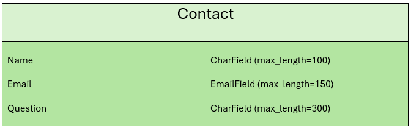

# Rainbow Runners
Welcome to Rainbow Runners, a vibrant virtual running club dedicated to the LGBTQ+ community in South Wales, UK. The website serves as a central hub for both members and enthusiasts to connect, share, and celebrate inclusivity through the joy of running. Here, you can find the regularly updated Club Posts section, which keeps you informed about upcoming events and important club updates. The Online Shop offers a range of merchandise, including exclusive club kit for members and a variety of running gear for non-members. Additionally, the website features a Contact Us page for inquiries and a dedicated section providing links to other LGBTQ+ clubs and charities in South Wales.


[Click here to view live website](https://rainbow-runners-03ee314b7993.herokuapp.com/)
***
**Contents**
- [Rainbow Runners](#rainbow-runners)
  - [User Stories](#user-stories)
      - [As A Non Member:](#as-a-non-member)
      - [As A Member:](#as-a-member)
      - [As A Returning Member:](#as-a-returning-member)
      - [Future Functionality:](#future-functionality)
  - [Wireframes](#wireframes)
      - [Mobile](#mobile)
      - [Tablet](#tablet)
      - [Desktop](#desktop)
  - [Design](#design)
    - [Overview](#overview)
    - [Typography](#typography)
    - [Color Palette](#color-palette)
    - [Framework](#framework)
    - [Features and Design](#features-and-design)
    - [Usage of Design Elements](#usage-of-design-elements)
    - [Accessibility](#accessibility)
    - [Conclusion](#conclusion)
  - [CRUD Functionality](#crud-functionality)
    - [Superuser Role](#superuser-role)
    - [Admin Role](#admin-role)
    - [Coordinator Role](#coordinator-role)
    - [Member Role](#member-role)
    - [Non-Member Role](#non-member-role)
    - [Comment Policy](#comment-policy)
  - [Database Configuration](#database-configuration)
    - [Non-Relational Database](#non-relational-database)
    - [Relational Database](#relational-database)
  - [Database Schema](#database-schema)
    - [Posts App](#posts-app)
    - [Profiles App](#profiles-app)
    - [Products App](#products-app)
    - [Checkout App](#checkout-app)
    - [Contact App](#contact-app)
  - [Technology](#technology)
    - [Languages  Used](#languages--used)
    - [Frameworks](#frameworks)
    - [Libraries](#libraries)
    - [Utilities Used](#utilities-used)
    - [Packages](#packages)
    - [Services](#services)
  - [Testing](#testing)
  - [Deployment](#deployment)
    - [Forking the Repository](#forking-the-repository)
    - [Cloning the Forked Repository](#cloning-the-forked-repository)
    - [Cloning with Git](#cloning-with-git)
    - [Creating a Local Django Environment](#creating-a-local-django-environment)
      - [Precursors](#precursors)
      - [Setup](#setup)
    - [Initial production deployment setup](#initial-production-deployment-setup)
      - [Setting up the ElephantSQL Database](#setting-up-the-elephantsql-database)
      - [Setting up an Amazon S3 Bucket for Static Website Hosting](#setting-up-an-amazon-s3-bucket-for-static-website-hosting)
        - [Creating and Configuring the S3 Bucket](#creating-and-configuring-the-s3-bucket)
        - [Configuring AWS IAM for Secure Access](#configuring-aws-iam-for-secure-access)
      - [Creating a New Heroku App](#creating-a-new-heroku-app)
        - [If using Heroku Postgres instead of ElephantSQL](#if-using-heroku-postgres-instead-of-elephantsql)
        - [Project Preparation in Your IDE](#project-preparation-in-your-ide)
        - [Update DATABASE Setting](#update-database-setting)
      - [Confirming Your Database](#confirming-your-database)
      - [Setting Up Heroku Deployment](#setting-up-heroku-deployment)
        - [Update Database Settings in `settings.py`](#update-database-settings-in-settingspy)
        - [Additional Deployment Steps](#additional-deployment-steps)
        - [Connecting Django to AWS S3](#connecting-django-to-aws-s3)
  - [Credits](#credits)
    - [Images](#images)
    - [Other Credits](#other-credits)
    - [Thank You](#thank-you)


***
## User Stories
#### As A Non Member:
1. As a non-member, I want to learn about the benefits of joining Rainbow Runners, so I can decide if it's the right community for me.
2. As a non-member, I want to access resources about other LGBTQ+ clubs and charities, so I can find the right club or support.
3. As a non-member, I hope to find contact information easily, so I can reach out with any questions I have about membership or the club's activities.
4. As a non-member, I want to be able to buy running merchandise, so I can show my support to the LGBTQ+ running community.
#### As A Member:
1. As a member, I want notifications about events, challenges, and updates, so I can keep up with the club.
2. As a member, I want to be able to buy club running t-shirts and other running merchandise, so I can show my support and feel a sense of belonging with the community while I run.
3. As a member, I would like to be able to deactivate me account should I wish to leave.
4. As a member, I would like to be able to provide feedback and comments on club events.
#### As A Returning Member:
1. As a returning member, I would like to be kept informed of any club news or events.
2. As a returning member, I would like to be able to buy more kit items and have my profile information saved for a faster checkout experience.
3. As a returning member I would like to be able to provide general feedback to the club and suggest improvements. 
#### Future Functionality:
1. As a non-member, I'd like to know how to support the club, such as through donations even if I don't join.
2. As a member, I wish to have a mobile app version of Rainbow Runners with GPS tracking, so I can access the community and track my runs on the go.
3. As a member interested in personal growth, I want to participate in virtual workshops and webinars on topics like mental health, nutrition, and advanced running techniques.
4. As a tech-savvy member, I want integration with popular fitness trackers and apps, so I can sync my activity data automatically with my Rainbow Runners profile.
5. As a member who values recognition, I would like a rewards system for participation and achievements, so I can feel acknowledged for my efforts and contributions.
***
## Wireframes
#### Mobile
[Mobile Homepage 1](resources/wireframes/Mobile-Home-1.png)                     
[Mobile Homepage 2](resources/wireframes/Mobile-Home-2.png)                    
[Mobile About Us](resources/wireframes/Mobile-About-Us.png)                   
[Mobile Resources](resources/wireframes/Mobile-Resources.png)                 
[Mobile Contact Us](resources/wireframes/Mobile-Contact-Us.png)                
[Mobile Shop](resources/wireframes/Mobile-Kit-Store.png)                    
[Mobile Product](resources/wireframes/Mobile-Product.png)                      
[Mobile Checkout 1](resources/wireframes/Mobile-Checkout.png)               
[Mobile Checkout 2](resources/wireframes/Mobile-Checkout-2.png)                
[Mobile Shopping Cart](resources/wireframes/Mobile-Shopping-Cart.png)           
[Mobile Profile](resources/wireframes/Mobile-Profile.png)                    
[Mobile Club Posts](resources/wireframes/Mobile-Team-Space.png)                 
[Mobile Register](resources/wireframes/Mobile-Register.png)               
[Mobile Sign In](resources/wireframes/Mobile-Sign-In.png)                     
#### Tablet
[Tablet Homepage 1](resources/wireframes/Tablet-Home-1.png)                 
[Tablet Homepage 2](resources/wireframes/Tablet-Home-2.png)                    
[Tablet Homepage 3](resources/wireframes/Tablet-Home-3.png)                   
[Tablet About Us](resources/wireframes/Tablet-About-Us.png)                    
[Tablet Resources](resources/wireframes/Tablet-Resources.png)                
[Tablet Contact Us](resources/wireframes/Tablet-Contact-Us.png)             
[Tablet Shop](resources/wireframes/Tablet-Kit-Store.png)                 
[Tablet Product](resources/wireframes/Tablet-Product.png)                   
[Tablet Checkout 1](resources/wireframes/Tablet-Checkout.png)               
[Tablet Checkout 2](resources/wireframes/Tablet-Checkout-2.png)               
[Tablet Shopping Cart](resources/wireframes/Tablet-Shopping-Cart.png)         
[Tablet Profile](resources/wireframes/Tablet-Profile.png)                     
[Tablet Club Posts](resources/wireframes/Tablet-Team-Space.png)                
[Tablet Register](resources/wireframes/Tablet-Register.png)              
[Tablet Sign In](resources/wireframes/Tablet-Sign-In.png)          
#### Desktop
[Desktop Homepage 1](resources/wireframes/Desktop-Home-1.png)                
[Desktop Homepage 2](resources/wireframes/Desktop-Home-2.png)                 
[Desktop About Us](resources/wireframes/Desktop-About-Us.png)                  
[Desktop Resources](resources/wireframes/Desktop-Resources.png)                 
[Desktop Contact Us](resources/wireframes/Desktop-Contact-Us.png)               
[Desktop Shop](resources/wireframes/Desktop-Kit-Store.png)                   
[Desktop Product](resources/wireframes/Desktop-Product.png)                  
[Desktop Checkout](resources/wireframes/Desktop-Checkout.png)                
[Desktop Shopping Cart](resources/wireframes/Desktop-Shopping-Cart.png)        
[Desktop Profile](resources/wireframes/Desktop-Profile.png)                     
[Desktop Club Posts](resources/wireframes/Desktop-Team-Space.png)              
[Desktop Register](resources/wireframes/Desktop-Register.png)                
[Desktop Sign In](resources/wireframes/Desktop-Sign-In.png)            
***
## Design

### Overview
The Rainbow Runners website is designed to reflect the spirit and inclusivity of the LGBTQ+ running community in South Wales. The site offers a user-friendly experience while generating community engagement through its visual and functional features.

### Typography
- **Hero Title**: Masque - This striking, contemporary font is used for the hero title, providing a bold visual impact that captures the user's attention with a fall back font of sans-serif. [Masque font from dafont.com](https://www.dafont.com/masque.font)                              

- **Sub Headings**: Roboto Slab - A robust serif font that complements the main titles by offering clarity and a subtle authoritative tone. The fall back font is sans-serif.                                    

- **Body Text**: Open Sans - Known for its readability and clean appearance, Open Sans is used for general text across the site, ensuring that information is accessible and easy to read. The fall back font is sans-serif.           


### Color Palette
The site features a rainbow-themed colour palette that not only pays homage to the LGBTQ+ flag but also adds a lively and welcoming feel to the user experience:
- Reds: `#E40303`, `#EB3A3A`
- Orange: `#FF8C00`
- Yellows: `#FFED00`, `#FFD23F`
- Greens: `#008026`, `#0EAD69`
- Blues: `#5BCEFA`, `#24408E`, `#1153b3`
- Purples: `#732982`, `#540D6E`
- Pink: `#FF718F`
- Cyan: `#3BCEAC`
- Neutrals: `#FFFFFF`, `#000000`

### Framework
The entire site is built using Bootstrap 5, ensuring responsiveness and modern web standards. Bootstrap’s grid system and components have been utilized to create a consistent layout that adapts seamlessly across devices, enhancing the user experience.

### Features and Design
- **Responsive Layout**: Adapts effectively across different screen sizes and orientations.
- **Navigation**: Streamlined, intuitive navigation structure that aligns with the site’s aesthetic and community needs.
- **Interactive Elements**: Dynamic components like dropdowns, modal windows, and tooltips that engage users throughout their journey on the site.

### Usage of Design Elements
Design elements are used to guide the user through the site’s content logically and smoothly:
- **Color**: Utilized to denote importance, categorize information, and direct user attention effectively.
- **Typography**: Hierarchical use of typography helps in maintaining structural clarity and enhancing readability.
- **Icons and Buttons**: Thoughtfully placed to facilitate user interaction and actions.

### Accessibility
Accessibility has been considered within the design with considerations for:
- **Color Contrast**: Ensuring that text stands out against background colors for readability by users with visual impairments.
- **Alt Text on Images**: All images include descriptive alt text to provide context for screen readers.

### Conclusion
The design approach for the Rainbow Runners website has a blend of aesthetic appeal, functional richness, and inclusive design principles. It aims to create not just a digital space but a welcoming community portal that resonates with the values of the LGBTQ+ community in South Wales.
***
## CRUD Functionality

The Rainbow Runners website offers comprehensive Create, Read, Update, and Delete (CRUD) capabilities tailored to different user roles within the platform. Below is a detailed overview of the permissions and functionalities available to each user role:

### Superuser Role
- **Access Control**: Full access to the Django admin area; can assign Admin and Coordinator roles to members.
- **Member Management**: Ability to activate and deactivate member accounts.
- **Content Management**:
  - Can add, edit, and delete posts.
  - Can add and delete comments on any post.
  - Can add, edit, and delete products.
- **Inquiries Management**: Can view any questions submitted through the contact us page.
- **Shopping Basket**:
  - Can add products to their shopping basket.
  - Can edit the quantity of products in the basket.
  - Can delete products from the basket.

### Admin Role
- **Content Management**:
  - Can add, edit, and delete posts.
  - Can add and delete comments on any post.
  - Can add, edit, and delete products.
- **Inquiries Viewing**: Can view any questions submitted but cannot delete them.
- **Profile Management**: Can update their profile and deactivate their account.
- **Shopping Basket**:
  - Can add products to their shopping basket.
  - Can edit the quantity of products in the basket.
  - Can delete products from the basket.

### Coordinator Role
- **Content Management**:
  - Can add, edit, and delete posts.
  - Can add and delete comments on any post.
- **Profile Management**: Can update their profile and deactivate their account.
- **Shopping Basket**:
  - Can add products to their shopping basket.
  - Can edit the quantity of products in the basket.
  - Can delete products from the basket.

### Member Role
- **Interaction**:
  - Can submit questions through the contact us page.
  - Can add and delete their own comments to club news posts.
- **Profile Management**: Can update their profile and deactivate their account.
- **Shopping Basket**:
  - Can add products to their shopping basket.
  - Can edit the quantity of products in the basket.
  - Can delete products from the basket.

### Non-Member Role
- **Interaction**: Can submit questions through the contact us page.
- **Shopping Basket**:
  - Can add products to their shopping basket.
  - Can edit the quantity of products in the basket.

### Comment Policy
Currently, users cannot edit comments. To change a comment, the user must delete the existing comment and post a new one. This policy aligns with current practices on many social media platforms, ensuring clarity and accountability in user communications. Future updates may include editable comments based on user feedback and requirements.

This structured access ensures that each user interacts with the site in a way that is appropriate to their role and responsibilities, maintaining a secure and orderly environment.
***
## Database Configuration

Rainbow Runners utilizes two different database systems to optimize data management and support the diverse functionalities of the website.

### Non-Relational Database

For storing inquiries and questions submitted through the contact page, I have chosen **MongoDB** as the non-relational database solution. MongoDB provides the flexibility required for handling data that does not require relational integrity, which is ideal for the independent nature of user inquiries. This setup allows for scalable data storage that can adapt to varying loads and data types without predefined schemas.

### Relational Database

For all other data that benefits from structured relationships and integrity, such as user data, product information, and transaction records, I have chosen to use **Heroku Postgresql**. I have selected the free tier of Heroku Postgresql for its reliability and longevity, especially given that ElephantSQL, the previous provider, is reaching the end of its life. Heroku Postgres offers a robust, scalable, and efficient relational database solution, ensuring data integrity and seamless operations for all aspects of the site that require relational data handling.
***
## Database Schema
This section provides a detailed overview of the relationships and structure of the database models used within the Django application. Each model is critical for various features of the site, from managing user profiles and club posts to handling product sales and user interactions. The schemas illustrates how these models connect to each other, ensuring data integrity and facilitating efficient data retrieval. Below are complete entity-relationship diagrams (ERD), outlining the fields and relationships of each model involved in the application.     
### Posts App

### Profiles App

### Products App

### Checkout App

### Contact App
A non-relational database has been implemented to manage inquiries and questions. This decision was made because the functionality for submitting questions does not necessitate a relationship with other data entities within the system. Users, including non-members, can submit inquiries without the need for an account or any association with the user profiles, orders, or products databases. A non-relational database provides the flexibility and scalability needed to handle this isolated data efficiently, ensuring that the website can manage high volumes of queries seamlessly without impacting the performance and integrity of the relational data structures used elsewhere in the application.                 


***
## Technology
### Languages  Used
- HTML            
- CSS                               
- Javascript  
- Python                     
### Frameworks
- [Django](https://www.djangoproject.com/) -  A high-level Python web framework.
- [Bootstrap5](https://getbootstrap.com/) - A Responsive front-end framework
### Libraries
- [jQuery](https://jquery.com/) - To connect the user interface with the javascript logic and supply functionality from Bootstrap.                     
- [Google Fonts](https://fonts.google.com/) - To select and Import fonts. 
- [Dafont](https://www.dafont.com/masque.font) - To select and Import fonts.                                     
### Utilities Used
- [Balsamiq Wireframes](https://www.mockplus.com/mockplus-rp) - To create wire-frames.
- Git - Version Control.
- [Github](https://github.com/) - To store repository and deploy site.
- [Cloud Convert](https://cloudconvert.com/) - To convert image files to webp and ico.
- [Tinypng](https://tinypng.com/) - For image Optimisation.
- [Google Chrome Dev Tools](https://developer.chrome.com/docs/devtools/) - Web Developer Tools.    
- [Favicon](https://favicon.io/) - To create Favicon images.
- [Creately](https://app.creately.com) - To create database schema.           
### Packages
- [Django-Allauth](https://docs.allauth.org/) - Provides a set of ready-to-use features that manage user accounts.        
- [Django-bleach](https://django-bleach.readthedocs.io/) -  Integrates the Bleach library to sanitize HTML.         
- [Django-CKEditor](https://django-ckeditor.readthedocs.io/) - Integrates for the CKEditor text editor.      
- [Django-crispy-forms](https://django-crispy-forms.readthedocs.io/) - Allows for elegant rendering of forms.       
- [Pillow](https://pypi.org/project/pillow/) - For image processing in Django.       
- [Psycopg 3](https://pypi.org/project/psycopg/) - To manage the PostgreSQL database using Python.      
### Services
- [Sentry](https://sentry.io) - Provides error tracking and application monitoring.         
- [Heroku Postgresql](https://elements.heroku.com/addons/heroku-postgresql) - To host and manage the PostgreSQL database.       
- [MongoDB](https://account.mongodb.com/) - To host and manage the MongoDB NoSQL database.  
- [AWS](https://www.aws.amazon.com) -  Cloud platform providing storage for static and media files.                 
- [Heroku](https://www.heroku.com/) - To build and host the website.      
- [Stripe](https://dashboard.stripe.com/) - To process payments.                                                               
***
## Testing
Please see [TESTING.md](/TESTING.md) for all testing performed.          
***
## Deployment
### Forking the Repository
1. On the top-right corner of the repository page, click on the button labeled "Fork."
2. Select the owner (if there is more than one account available).
3. Rename the repository if required.
4. Add a description (this step is optional).
5. Click on the green "Create Fork" button.

### Cloning the Forked Repository
1. After forking the repository, you will be redirected to the forked copy of the repository.
2. On the right side of the repository page, click on the green "Code" button.
3. A dropdown will appear with options to clone the repository. Select the HTTPS option for a local setup.
4. Click the clipboard icon next to the repository URL to copy it to the clipboard. You can now clone the repository onto your local machine.

### Cloning with Git
1. Open a terminal or command prompt on your computer.
2. Use the `cd` command to navigate to the directory where you want to clone the repository.
3. When in the required directory, use the `git clone` command followed by the repository URL you copied earlier.
4. To execute the `git clone` command press enter.
5. Git will download the repository files onto your computer, creating a new directory with the repository name.

### Creating a Local Django Environment
#### Precursors
- Ensure Python >=3.8 and pip are installed.

#### Setup
1. Create a virtual environment: `python -m venv env
source env/bin/activate` On Windows use `env\Scripts\activate`                
2. Install Django and other dependencies:  `pip install -r requirements.txt`                                 
3. Migrate the database using the default SQLite3: `python manage.py migrate`
4. Create env.py file in root by using the template env file provided.
5. Ensure `DEVELOPMENT` setting is set to true.
6. Ensure `SECRET_KEY` setting has a unique string value.
7. Save the `env.py` file.
   1. Open the `.gitignore` file and ensure the `env.py` file is displayed in the list. If not add `env.py` to the list of files and save.
8. Add a new super user by using the following command in a terminal: `python manage.py createsuperuser`            
9. Apply fixtures to the database which seeds data into the tables, run the following command from a terminal: `python manage.py loaddata category metadata metadatacategories product groups`
10. Run the development server to verify everything is working: `python manage.py runserver`     

### Initial production deployment setup

This website has been deployed to Heroku with Heroku Postgresql hosting the PostgreSQL database however if using ElephantSQL use the following method:

#### Setting up the ElephantSQL Database  

Log into ElephantSQL and create database instance.
1. Click on "Create New Instance".
2. Input an instance name (this is usually the name of your project).
3. Select the free Tiny Turtle plan.
4. Leave the tags field blank.
5. Select a region closest to you for the data center.
6. Review your instance details and confirm by creating the instance.
7. Copy the URL of the newly created database instance for later use.

#### Setting up an Amazon S3 Bucket for Static Website Hosting

This guide will walk you through the process of setting up an Amazon S3 bucket for hosting a static website, including necessary permissions and security configurations using AWS IAM.

##### Creating and Configuring the S3 Bucket

1. **Create an AWS Account**:
   - Sign up or log into your Amazon AWS account.

2. **Create a New S3 Bucket**:
   - Navigate to the S3 service in the AWS Management Console.
   - Click "Create bucket".
   - Provide a unique bucket name and select an appropriate region.
   - Uncheck "Block all public access" under the permissions settings to allow public access.
   - Acknowledge the warning that the bucket will be publicly accessible.

3. **Enable Static Website Hosting**:
   - Go to the "Properties" tab for your bucket.
   - Activate "Static website hosting".
   - Set 'index.html' as the index document.
   - Click "Save".

4. **Configure CORS**:
   - Move to the "Permissions" tab and click on "CORS configuration".
   - Input the following JSON and save:
     ```json
     [
       {
         "AllowedHeaders": ["Authorization"],
         "AllowedMethods": ["GET"],
         "AllowedOrigins": ["*"],
         "ExposeHeaders": []
       }
     ]
     ```

5. **Set Up Bucket Policy**:
   - Still under the "Permissions" tab, click "Bucket Policy".
   - Generate a Bucket Policy using the policy generator:
     - Select "S3 Bucket Policy" as the type.
     - Set principal to "*".
     - Paste the ARN from your bucket.
     - Add the statement and generate the policy.
   - Copy and paste the generated policy JSON into the bucket policy editor.
   - Save your changes.

6. **Adjust Access Control List (ACL)**:
   - Under "Access control list (ACL)", grant "List" permissions to "Everyone (public access)".
   - Confirm to acknowledge public access.
   - Save the configuration.

##### Configuring AWS IAM for Secure Access

1. **Create an IAM User Group**:
   - From the IAM dashboard, select "User Groups".
   - Create a new group (e.g., `manage-rainbow-runners`).
   - Proceed without adding a policy directly; create the group.

2. **Create and Attach a Policy**:
   - Select "Policies" and then "Create policy".
   - Use the JSON tab to import the "AmazonS3FullAccess" managed policy.
   - Modify the resource block to include your bucket's ARN, like so:
     ```json
     "Resource": [
       "arn:aws:s3:::rainbow-runners",
       "arn:aws:s3:::rainbow-runners/*"
     ]
     ```
   - Name your policy (e.g., `rainbow-runners-policy`) and create it.

3. **Attach Policy to Group**:
   - Go back to your user group, select it, and attach the newly created policy under "Permissions".

4. **Create an IAM User**:
   - In "Users", create a new user (e.g., `rainbow-runners-staticfiles-user`) with "Programmatic access".
   - Add this user to the group you created.
   - Finalize user creation and download the .csv file containing their access key and secret. This is crucial as it cannot be downloaded again later.

#### Creating a New Heroku App

1. **Log Into Heroku**:

- Ensure you have a Heroku account ready. Log into Heroku and navigate to your Dashboard.

2. **Creating a New App**
**Initiate App Creation**

- On the Heroku Dashboard, look for and click the **"New"** button, then select **"Create new app"** from the dropdown.

**Configure Your App**

- **App Name**: Give your app a unique name. Heroku app names must be globally unique across all users.
- **Region**: Select the region that is geographically closest to you. This helps in minimizing latency for your app.

**Finalize App Creation**

- Once you've configured your app's name and selected the appropriate region, click **"Create app"** to confirm and finalize the creation of your new Heroku app.

3. **Configuring Your App**

**Open the Settings Tab**

- Navigate to the **Settings** tab of your newly created app. This is where you can manage configurations and other settings for your Heroku app.

**Add Database Configuration**

- Scroll down to the **Config Vars** section and click on the **"Reveal Config Vars"** button.
- **Key**: Enter `DATABASE_URL` as the key.
- **Value**: Paste the database URL you copied from ElephantSQL.

**Save Config Var**

- After adding the `DATABASE_URL` config var with the appropriate value from ElephantSQL, ensure it's saved correctly.

##### If using Heroku Postgres instead of ElephantSQL
1. **Navigate to Resources Tab:**
On your application's dashboard, click on the "Resources" tab.
2. **Add Heroku Postgres:**
In the "Add-ons" search bar, type "Heroku Postgres" and select it when it appears.
3. **Select a Plan:**
Choose the free "Hobby Dev - Free" plan.
4. **Provision the Database:**
Click on the "Provision" button to add the Heroku Postgres service to your application. Heroku will automatically attach the database to your application and set the DATABASE_URL in your app’s configuration.
5. **Verify Installation:**
After provisioning, go back to the "Settings" tab, and under the "Config Vars" section, you should see the DATABASE_URL. This URL is the connection string that your application will use to connect to the Postgres database.

##### Project Preparation in Your IDE

1. **Install Required Packages**

Open your IDE and execute the following commands in your terminal:

```bash
pip3 install dj_database_url==0.5.0 psycopg2
```

- `dj_database_url` facilitates connecting to various databases using their URL.
- `psycopg2` is a PostgreSQL adapter for Python.

2. **Update Requirements**

Update your `requirements.txt` to include the newly installed packages.

```bash
pip freeze > requirements.txt
```

3. **Modify `settings.py`**

In your `settings.py`, import `dj_database_url` under the import for `os`.

```python
import os
import dj_database_url
```

##### Update DATABASE Setting

Comment out the original SQLite connection and add a new connection to use ElephantSQL.

```python
# DATABASES = {
#     'default': {
#         'ENGINE': 'django.db.backends.sqlite3',
#         'NAME': os.path.join(BASE_DIR, 'db.sqlite3'),
#     }
# }

DATABASES = {
    'default': dj_database_url.parse('your-database-url-here')
}
```

**Important:** Do not commit this change with your database URL. This step is temporary for migration purposes.

4. **Verify Database Connection**

Run the following command to ensure you're connected to the external database:

```bash
python manage.py showmigrations
```

You should see a list of migrations none of which are applied yet.

5. **Migrate Database Models**

Execute the migrate command to apply database models to your new database:

```bash
python manage.py migrate
```

6. **Load Fixtures**

Load the fixtures: `python manage.py loaddata category metadata metadatacategories product groups`

7. **Create a Superuser**

Create a superuser for your new database:

```bash
python manage.py createsuperuser
```

Follow the prompts to set up your superuser's username, password, and email (optional).

8. **Revert `settings.py` Changes**

To prevent exposing our database URL, revert the `DATABASES` setting in `settings.py` to use the local SQLite database again.

```python
DATABASES = {
    'default': {
        'ENGINE': 'django.db.backends.sqlite3',
        'NAME': os.path.join(BASE_DIR, 'db.sqlite3'),
    }
}
```
#### Confirming Your Database

After setting up the database and performing migrations, it's essential to confirm that the data in your ElephantSQL database has been correctly created. This step ensures that your database tables are set up and that you can successfully add data to your database, including your superuser account.

1. **Access ElephantSQL Database Browser**

Navigate to your ElephantSQL dashboard and open the database instance you created for your project. On the left side navigation menu, click on **"BROWSER"** to access the database browser feature.

2. **Query the Database**

In the browser view, you'll find a **Table queries** button or section. Use this to select the table you wish to query. For confirming your superuser has been created, select the **auth_user** table from the dropdown menu or list.

3. **Execute the Query**

With the **auth_user** table selected, click on **"Execute"** to run the query against your database. This action will display the contents of the `auth_user` table.

4. **Confirm Your Superuser Details**

After executing the query, you should see a list of users in the table. Look for the details of the superuser account you created during the setup process. Confirming the presence and accuracy of your superuser details in the `auth_user` table indicates that your migrations were successful, and your database tables have been correctly created.

#### Setting Up Heroku Deployment

After preparing your project in your IDE and confirming your database with ElephantSQL, deploy the application on Heroku and ensure it uses the correct database depending on the environment it's running in.

##### Update Database Settings in `settings.py`

Modify `settings.py` to dynamically switch between databases (Postgres on Heroku and SQLite locally).

```python
import dj_database_url
import os

# Existing DATABASES setting
# DATABASES = {
#     'default': {
#         'ENGINE': 'django.db.backends.sqlite3',
#         'NAME': os.path.join(BASE_DIR, 'db.sqlite3'),
#     }
# }

# New DATABASES setting
if "DATABASE_URL" in os.environ:
    DATABASES = {
        'default': dj_database_url.parse(os.environ.get("DATABASE_URL"))
    }
else:
    DATABASES = {
        'default': {
            'ENGINE': 'django.db.backends.sqlite3',
            'NAME': os.path.join(BASE_DIR, 'db.sqlite3'),
        }
    }
```
##### Additional Deployment Steps

1. **Install Gunicorn:**  

   ```bash
   pip3 install gunicorn
   pip freeze > requirements.txt
   ```

2. **Create a Procfile:**  
   ```
   web: gunicorn rainbow_runners.wsgi:application
   ```

3. **Disable `collectstatic`:**  

   ```bash
   heroku config:set DISABLE_COLLECTSTATIC=1 --app rainbow-runners
   ```

4. **Update `ALLOWED_HOSTS` in `settings.py`:**  
   Include your Heroku app's hostname and localhost.
   ```python
   ALLOWED_HOSTS = ['rainbow-runners.herokuapp.com', 'localhost']
   ```

5. **Set Up Automatic Deploys from GitHub:**  
   In the Heroku dashboard, connect your GitHub repository to your Heroku app and enable automatic deploys.

6. **Manage Secret Keys:**  
   - Modify `settings.py` to fetch the secret key and set the `DEBUG` value based on the environment.
     ```python
     DEBUG = 'DEVELOPMENT' in os.environ
     ```

7. **Disable Email Verification on Deployed Sites:**  
   To avoid 500 errors during login, change the following line to your `settings.py`:
   ```python
   ACCOUNT_EMAIL_VERIFICATION = 'mandatory'
   # Change to:
   ACCOUNT_EMAIL_VERIFICATION = 'none'
   ```

##### Connecting Django to AWS S3

1. **Install Required Packages**

You'll need to install `boto3` and `django-storages` to interface with AWS services and integrate S3 with Django:

```bash
pip3 install boto3 django-storages
```

Remember to update your `requirements.txt` to ensure these packages are installed on Heroku:

```bash
pip freeze > requirements.txt
```

2. **Update Django Settings**

- Add `storages` to your `INSTALLED_APPS` in `settings.py`.
- To configure Django to use AWS S3, add the following settings within an if statement that checks for a `USE_AWS` environment variable. This ensures these settings are only applied in production on Heroku:

```python
if 'USE_AWS' in os.environ:
    AWS_STORAGE_BUCKET_NAME = 'your-bucket-name'
    AWS_S3_REGION_NAME = 'your-region'
    AWS_ACCESS_KEY_ID = os.environ.get('AWS_ACCESS_KEY_ID')
    AWS_SECRET_ACCESS_KEY = os.environ.get('AWS_SECRET_ACCESS_KEY')
```

- Ensure you replace `'your-bucket-name'` and `'your-region'` with your actual bucket name and AWS region.

3. **Configure Heroku Environment Variables**

Go to your Heroku app's settings and add your `AWS_ACCESS_KEY_ID`, `AWS_SECRET_ACCESS_KEY`, and `USE_AWS` set to `True` as config vars.

| KEY | VALUE |               
| :--- | :----: |                                       
| AWS_ACCESS_KEY_ID | `your variable here if you have it already` |         
| AWS_SECRET_ACCESS_KEY | `your variable here if you have it already` |      
| DISABLE_COLLECTSTATIC | 1* |                                       
| DATABASE_URL | `your variable here` |                             
| EMAIL_HOST_PASS | `your variable here` |                              
| EMAIL_HOST_USER | `your variable here` |                               
| SECRET_KEY | `your variable here` |                                   
| STRIPE_PUBLIC_KEY | `your variable here` |                             
| STRIPE_SECRET_KEY | `your variable here` |                            
| STRIPE_WH_SECRET | `your variable here` |                                
| USE_AWS | True |                                             
| DEVELOPMENT | True* |                                      

      * Remove this before completing the deployment. 

1. **Configure Static and Media Files**

- Set the S3 bucket URL for static files in `settings.py`:

```python
AWS_S3_CUSTOM_DOMAIN = f'{AWS_STORAGE_BUCKET_NAME}.s3.amazonaws.com'
```

- Tell Django to use S3 for static and media file storage in production:

```python
STATICFILES_STORAGE = 'custom_storages.StaticStorage'
DEFAULT_FILE_STORAGE = 'custom_storages.MediaStorage'
STATICFILES_LOCATION = 'static'
MEDIAFILES_LOCATION = 'media'
```

- Create a `custom_storages.py` file in your project directory. Import `S3Boto3Storage` and define two classes, `StaticStorage` and `MediaStorage`, that specify the locations for static and media files respectively.

5. **Update URLs for Static and Media Files**

- Override the URLs for static and media files in `settings.py` to point to your S3 bucket.

```python
STATIC_URL = f'https://{AWS_S3_CUSTOM_DOMAIN}/{STATICFILES_LOCATION}/'
MEDIA_URL = f'https://{AWS_S3_CUSTOM_DOMAIN}/{MEDIAFILES_LOCATION}/'
```
- Add a setting in `settings.py` to instruct browsers to cache static files for an extended period. This improves performance due to decreased load times.  

```python
    AWS_S3_OBJECT_PARAMETERS = {
        'Expires': 'Thu, 31 Dec 2099 20:00:00 GMT',
        'CacheControl': 'max-age=94608000',
    }
```
6. **Uploading Media Files to S3**
- Navigate to your S3 bucket in the AWS Management Console.
- Create a new folder named `media`.
- Click **Upload**, select all your product images, and upload them.
  - Ensure you grant public read access to these objects during the upload process.

7. **Commit Changes**
- Commit your changes and push them to GitHub. This will trigger an automatic deployment to Heroku if you've set up automatic deploys.
***
## Credits
### Images
 - Hero Image - This image was AI generated 
 - Runner Image - Photo by Chris Grabham

### Other Credits
- Code Institute - Project Boutique ADO
- [Real Python](https://realpython.com/)
- [freeCodeCamp](https://www.freecodecamp.org/)
- [Web Dev Simplified](https://www.youtube.com/@WebDevSimplified)
- [Codemy.com](https://www.youtube.com/channel/UCFB0dxMudkws1q8w5NJEAmw)

### Thank You
* Amy (Cohort Facilitator) for providing support and guidance within weekly stand ups.
* Graeme Taylor (Course Mentor) for providing support and guidance throughout the project.
* Adam Davies for help with additional testing of the website. 
***
