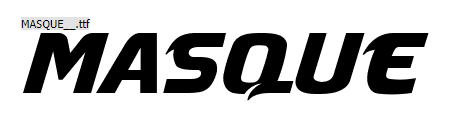

# Rainbow Runners
Welcome to Rainbow Runners, a vibrant virtual running club dedicated to the LGBTQ+ community in South Wales, UK. The website serves as a central hub for both members and enthusiasts to connect, share, and celebrate inclusivity through the joy of running. Here, you can find the regularly updated Club Posts section, which keeps you informed about upcoming events and important club updates. The Online Shop offers a range of merchandise, including exclusive club kit for members and a variety of running gear for non-members. Additionally, the website features a Contact Us page for inquiries and a dedicated section providing links to other LGBTQ+ clubs and charities in South Wales.

[Click here to view live website](https://rainbow-runners-03ee314b7993.herokuapp.com/)
***
**Contents**
- [Rainbow Runners](#rainbow-runners)
  - [User Stories](#user-stories)
      - [As A Non Member:](#as-a-non-member)
      - [As A Member:](#as-a-member)
      - [As A Returning Member:](#as-a-returning-member)
      - [Future Functionality:](#future-functionality)
  - [Wireframes](#wireframes)
      - [Mobile](#mobile)
      - [Tablet](#tablet)
      - [Desktop](#desktop)
  - [Design](#design)
    - [Overview](#overview)
    - [Typography](#typography)
    - [Color Palette](#color-palette)
    - [Framework](#framework)
    - [Features and Design](#features-and-design)
    - [Usage of Design Elements](#usage-of-design-elements)
    - [Accessibility](#accessibility)
    - [Conclusion](#conclusion)
  - [CRUD Functionality](#crud-functionality)
    - [Superuser Role](#superuser-role)
    - [Admin Role](#admin-role)
    - [Coordinator Role](#coordinator-role)
    - [Member Role](#member-role)
    - [Non-Member Role](#non-member-role)
    - [Comment Policy](#comment-policy)
  - [Database Configuration](#database-configuration)
    - [Non-Relational Database](#non-relational-database)
    - [Relational Database](#relational-database)
  - [Database Schema](#database-schema)
    - [Posts App](#posts-app)
    - [Profiles App](#profiles-app)
    - [Products App](#products-app)
    - [Checkout App](#checkout-app)
    - [Contact App](#contact-app)
  - [Technology](#technology)
    - [Languages  Used](#languages--used)
    - [Frameworks](#frameworks)
    - [Libraries](#libraries)
    - [Utilities Used](#utilities-used)
    - [Packages](#packages)
    - [Services](#services)

***
## User Stories
#### As A Non Member:
1. As a non-member, I want to learn about the benefits of joining Rainbow Runners, so I can decide if it's the right community for me.
2. As a non-member, I want to access resources about other LGBTQ+ clubs and charities, so I can find the right club or support.
3. As a non-member, I hope to find contact information easily, so I can reach out with any questions I have about membership or the club's activities.
4. As a non-member, I want to be able to buy running merchandise, so I can show my support to the LGBTQ+ running community.
#### As A Member:
1. As a member, I want notifications about events, challenges, and updates, so I can keep up with the club.
2. As a member, I want to be able to buy club running t-shirts and other running merchandise, so I can show my support and feel a sense of belonging with the community while I run.
3. As a member, I would like to be able to deactivate me account should I wish to leave.
4. As a member, I would like to be able to provide feedback and comments on club events.
#### As A Returning Member:
1. As a returning member, I would like to be kept informed of any club news or events.
2. As a returning member, I would like to be able to buy more kit items and have my profile information saved for a faster checkout experience.
3. As a returning member I would like to be able to provide general feedback to the club and suggest improvements. 
#### Future Functionality:
1. As a non-member, I'd like to know how to support the club, such as through donations even if I don't join.
2. As a member, I wish to have a mobile app version of Rainbow Runners with GPS tracking, so I can access the community and track my runs on the go.
3. As a member interested in personal growth, I want to participate in virtual workshops and webinars on topics like mental health, nutrition, and advanced running techniques.
4. As a tech-savvy member, I want integration with popular fitness trackers and apps, so I can sync my activity data automatically with my Rainbow Runners profile.
5. As a member who values recognition, I would like a rewards system for participation and achievements, so I can feel acknowledged for my efforts and contributions.
***
## Wireframes
#### Mobile
[Mobile Homepage 1](resources/wireframes/Mobile-Home-1.png)                     
[Mobile Homepage 2](resources/wireframes/Mobile-Home-2.png)                    
[Mobile About Us](resources/wireframes/Mobile-About-Us.png)                   
[Mobile Resources](resources/wireframes/Mobile-Resources.png)                 
[Mobile Contact Us](resources/wireframes/Mobile-Contact-Us.png)                
[Mobile Shop](resources/wireframes/Mobile-Kit-Store.png)                    
[Mobile Product](resources/wireframes/Mobile-Product.png)                      
[Mobile Checkout 1](resources/wireframes/Mobile-Checkout.png)               
[Mobile Checkout 2](resources/wireframes/Mobile-Checkout-2.png)                
[Mobile Shopping Cart](resources/wireframes/Mobile-Shopping-Cart.png)           
[Mobile Profile](resources/wireframes/Mobile-Profile.png)                    
[Mobile Club Posts](resources/wireframes/Mobile-Team-Space.png)                 
[Mobile Register](resources/wireframes/Mobile-Register.png)               
[Mobile Sign In](resources/wireframes/Mobile-Sign-In.png)                     
#### Tablet
[Tablet Homepage 1](resources/wireframes/Tablet-Home-1.png)                 
[Tablet Homepage 2](resources/wireframes/Tablet-Home-2.png)                    
[Tablet Homepage 3](resources/wireframes/Tablet-Home-3.png)                   
[Tablet About Us](resources/wireframes/Tablet-About-Us.png)                    
[Tablet Resources](resources/wireframes/Tablet-Resources.png)                
[Tablet Contact Us](resources/wireframes/Tablet-Contact-Us.png)             
[Tablet Shop](resources/wireframes/Tablet-Kit-Store.png)                 
[Tablet Product](resources/wireframes/Tablet-Product.png)                   
[Tablet Checkout 1](resources/wireframes/Tablet-Checkout.png)               
[Tablet Checkout 2](resources/wireframes/Tablet-Checkout-2.png)               
[Tablet Shopping Cart](resources/wireframes/Tablet-Shopping-Cart.png)         
[Tablet Profile](resources/wireframes/Tablet-Profile.png)                     
[Tablet Club Posts](resources/wireframes/Tablet-Team-Space.png)                
[Tablet Register](resources/wireframes/Tablet-Register.png)              
[Tablet Sign In](resources/wireframes/Tablet-Sign-In.png)          
#### Desktop
[Desktop Homepage 1](resources/wireframes/Desktop-Home-1.png)                
[Desktop Homepage 2](resources/wireframes/Desktop-Home-2.png)                 
[Desktop About Us](resources/wireframes/Desktop-About-Us.png)                  
[Desktop Resources](resources/wireframes/Desktop-Resources.png)                 
[Desktop Contact Us](resources/wireframes/Desktop-Contact-Us.png)               
[Desktop Shop](resources/wireframes/Desktop-Kit-Store.png)                   
[Desktop Product](resources/wireframes/Desktop-Product.png)                  
[Desktop Checkout](resources/wireframes/Desktop-Checkout.png)                
[Desktop Shopping Cart](resources/wireframes/Desktop-Shopping-Cart.png)        
[Desktop Profile](resources/wireframes/Desktop-Profile.png)                     
[Desktop Club Posts](resources/wireframes/Desktop-Team-Space.png)              
[Desktop Register](resources/wireframes/Desktop-Register.png)                
[Desktop Sign In](resources/wireframes/Desktop-Sign-In.png)            
***
## Design

### Overview
The Rainbow Runners website is designed to reflect the spirit and inclusivity of the LGBTQ+ running community in South Wales. The site offers a user-friendly experience while generating community engagement through its visual and functional features.

### Typography
- **Hero Title**: Masque - This striking, contemporary font is used for the hero title, providing a bold visual impact that captures the user's attention with a fall back font of sans-serif. [Masque font from dafont.com](https://www.dafont.com/masque.font)                              

- **Sub Headings**: Roboto Slab - A robust serif font that complements the main titles by offering clarity and a subtle authoritative tone. The fall back font is sans-serif.                                    

- **Body Text**: Open Sans - Known for its readability and clean appearance, Open Sans is used for general text across the site, ensuring that information is accessible and easy to read. The fall back font is sans-serif.           

### Color Palette
The site features a rainbow-themed colour palette that not only pays homage to the LGBTQ+ flag but also adds a lively and welcoming feel to the user experience:
- Reds: `#E40303`, `#EB3A3A`
- Orange: `#FF8C00`
- Yellows: `#FFED00`, `#FFD23F`
- Greens: `#008026`, `#0EAD69`
- Blues: `#5BCEFA`, `#24408E`, `#1153b3`
- Purples: `#732982`, `#540D6E`
- Pink: `#FF718F`
- Cyan: `#3BCEAC`
- Neutrals: `#FFFFFF`, `#000000`

### Framework
The entire site is built using Bootstrap 5, ensuring responsiveness and modern web standards. Bootstrap’s grid system and components have been utilized to create a consistent layout that adapts seamlessly across devices, enhancing the user experience.

### Features and Design
- **Responsive Layout**: Adapts effectively across different screen sizes and orientations.
- **Navigation**: Streamlined, intuitive navigation structure that aligns with the site’s aesthetic and community needs.
- **Interactive Elements**: Dynamic components like dropdowns, modal windows, and tooltips that engage users throughout their journey on the site.

### Usage of Design Elements
Design elements are used to guide the user through the site’s content logically and smoothly:
- **Color**: Utilized to denote importance, categorize information, and direct user attention effectively.
- **Typography**: Hierarchical use of typography helps in maintaining structural clarity and enhancing readability.
- **Icons and Buttons**: Thoughtfully placed to facilitate user interaction and actions.

### Accessibility
Accessibility has been considered within the design with considerations for:
- **Color Contrast**: Ensuring that text stands out against background colors for readability by users with visual impairments.
- **Alt Text on Images**: All images include descriptive alt text to provide context for screen readers.

### Conclusion
The design approach for the Rainbow Runners website has a blend of aesthetic appeal, functional richness, and inclusive design principles. It aims to create not just a digital space but a welcoming community portal that resonates with the values of the LGBTQ+ community in South Wales.
***
## CRUD Functionality

The Rainbow Runners website offers comprehensive Create, Read, Update, and Delete (CRUD) capabilities tailored to different user roles within the platform. Below is a detailed overview of the permissions and functionalities available to each user role:

### Superuser Role
- **Access Control**: Full access to the Django admin area; can assign Admin and Coordinator roles to members.
- **Member Management**: Ability to activate and deactivate member accounts.
- **Content Management**:
  - Can add, edit, and delete posts.
  - Can add and delete comments on any post.
  - Can add, edit, and delete products.
- **Inquiries Management**: Can view and delete any questions submitted through the contact us page within the Django admin.
- **Shopping Basket**:
  - Can add products to their shopping basket.
  - Can edit the quantity of products in the basket.
  - Can delete products from the basket.

### Admin Role
- **Content Management**:
  - Can add, edit, and delete posts.
  - Can add and delete comments on any post.
  - Can add, edit, and delete products.
- **Inquiries Viewing**: Can view any questions submitted but cannot delete them.
- **Profile Management**: Can update their profile and deactivate their account.
- **Shopping Basket**:
  - Can add products to their shopping basket.
  - Can edit the quantity of products in the basket.
  - Can delete products from the basket.

### Coordinator Role
- **Content Management**:
  - Can add, edit, and delete posts.
  - Can add and delete comments on any post.
- **Profile Management**: Can update their profile and deactivate their account.
- **Shopping Basket**:
  - Can add products to their shopping basket.
  - Can edit the quantity of products in the basket.
  - Can delete products from the basket.

### Member Role
- **Interaction**:
  - Can submit questions through the contact us page.
  - Can add and delete their own comments to club news posts.
- **Profile Management**: Can update their profile and deactivate their account.
- **Shopping Basket**:
  - Can add products to their shopping basket.
  - Can edit the quantity of products in the basket.
  - Can delete products from the basket.

### Non-Member Role
- **Interaction**: Can submit questions through the contact us page.
- **Shopping Basket**:
  - Can add products to their shopping basket.
  - Can edit the quantity of products in the basket.

### Comment Policy
Currently, users cannot edit comments. To change a comment, the user must delete the existing comment and post a new one. This policy aligns with current practices on many social media platforms, ensuring clarity and accountability in user communications. Future updates may include editable comments based on user feedback and requirements.

This structured access ensures that each user interacts with the site in a way that is appropriate to their role and responsibilities, maintaining a secure and orderly environment.
***
## Database Configuration

Rainbow Runners utilizes two different database systems to optimize data management and support the diverse functionalities of the website.

### Non-Relational Database

For storing inquiries and questions submitted through the contact page, I have chosen **MongoDB** as the non-relational database solution. MongoDB provides the flexibility required for handling data that does not require relational integrity, which is ideal for the independent nature of user inquiries. This setup allows for scalable data storage that can adapt to varying loads and data types without predefined schemas.

### Relational Database

For all other data that benefits from structured relationships and integrity, such as user data, product information, and transaction records, I have chosen to use **Heroku Postgresql**. I have selected the free tier of Heroku Postgresql for its reliability and longevity, especially given that ElephantSQL, the previous provider, is reaching the end of its life. Heroku Postgres offers a robust, scalable, and efficient relational database solution, ensuring data integrity and seamless operations for all aspects of the site that require relational data handling.
***
## Database Schema
This section provides a detailed overview of the relationships and structure of the database models used within the Django application. Each model is critical for various features of the site, from managing user profiles and club posts to handling product sales and user interactions. The schemas illustrates how these models connect to each other, ensuring data integrity and facilitating efficient data retrieval. Below are complete entity-relationship diagrams (ERD), outlining the fields and relationships of each model involved in the application.     
### Posts App

### Profiles App

### Products App

### Checkout App

### Contact App
A non-relational database has been implemented to manage inquiries and questions. This decision was made because the functionality for submitting questions does not necessitate a relationship with other data entities within the system. Users, including non-members, can submit inquiries without the need for an account or any association with the user profiles, orders, or products databases. A non-relational database provides the flexibility and scalability needed to handle this isolated data efficiently, ensuring that the website can manage high volumes of queries seamlessly without impacting the performance and integrity of the relational data structures used elsewhere in the application.                 

***
## Technology
### Languages  Used
- HTML            
- CSS                               
- Javascript  
- Python                     
### Frameworks
- [Django](https://www.djangoproject.com/) -  A high-level Python web framework.
- [Bootstrap5](https://getbootstrap.com/) - A Responsive front-end framework
### Libraries
- [jQuery](https://jquery.com/) - To connect the user interface with the javascript logic and supply functionality from Bootstrap.                     
- [Google Fonts](https://fonts.google.com/) - To select and Import fonts. 
- [Dafont](https://www.dafont.com/masque.font) - To select and Import fonts.                                     
### Utilities Used
- [Balsamiq Wireframes](https://www.mockplus.com/mockplus-rp) - To create wire-frames.
- Git - Version Control.
- [Github](https://github.com/) - To store repository and deploy site.
- [Cloud Convert](https://cloudconvert.com/) - To convert image files to webp and ico.
- [Tinypng](https://tinypng.com/) - For image Optimisation.
- [Google Chrome Dev Tools](https://developer.chrome.com/docs/devtools/) - Web Developer Tools.    
- [Favicon](https://favicon.io/) - To create Favicon images.
- [Creately](https://app.creately.com) - To create database schema.           
### Packages
- [Django-Allauth](https://docs.allauth.org/) - Provides a set of ready-to-use features that manage user accounts.        
- [Django-bleach](https://django-bleach.readthedocs.io/) -  Integrates the Bleach library to sanitize HTML.         
- [Django-CKEditor](https://django-ckeditor.readthedocs.io/) - Integrates for the CKEditor text editor.      
- [Django-crispy-forms](https://django-crispy-forms.readthedocs.io/) - Allows for elegant rendering of forms.       
### Services
- [Sentry](https://sentry.io) - Provides error tracking and application monitoring.         
- [Heroku Postgresql](https://elements.heroku.com/addons/heroku-postgresql) - To host and manage the PostgreSQL database.       
- [MongoDB](https://account.mongodb.com/) - To host and manage the MongoDB NoSQL database.  
- [AWS](https://www.aws.amazon.com) -  Cloud platform providing storage for static and media files.                 
- [Heroku](https://www.heroku.com/) - To build and host the website.                                                                   
***

