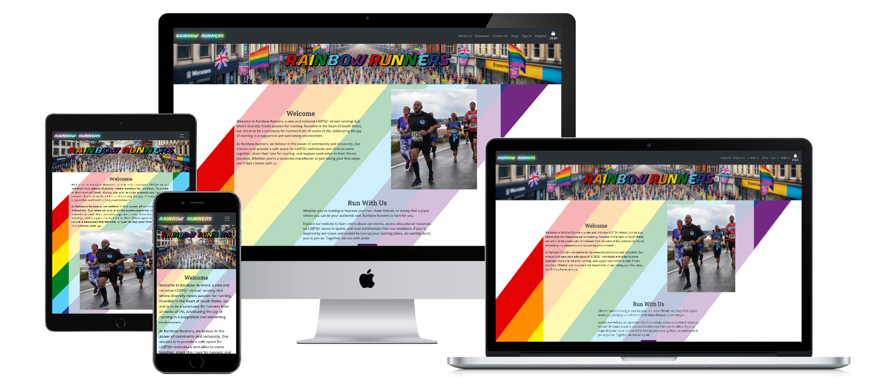

# Rainbow Runners - Testing

***
**Contents**
- [Rainbow Runners - Testing](#rainbow-runners---testing)
  - [Responsiveness](#responsiveness)
***
## Responsiveness
This website has been tested on a wide range of screen sizes from various manufacturers to account for the differences between them. It’s crucial to test website responsiveness due to the web being mostly accessed using mobile devices. A responsive website guarantees a uniform user experience across different screen sizes and resolutions, making it easy for visitors to access and navigate the site, regardless of the device they’re using. Additionally, responsive design enhances search engine optimization (SEO), as search engines prioritize mobile-friendly sites in their rankings. The testing has been carried out using the device list on the chrome developer tools.
 
 
The resolutions tested as as follows: 
Galaxy S III: 360 x 640 
Iphone SE: 375 x 667 
Iphone 12 Pro: 390 x 844 
Moto G Power: 412 x 823 
Ipad Air: 768 x 1024 
Nexus 10: 800 x 1280 
Desktop 1080p: 1920 x 1080 