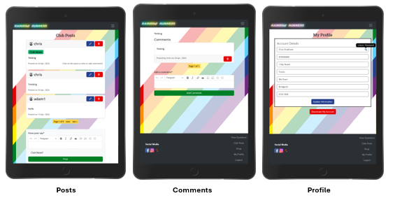

# Rainbow Runners - Testing

***
**Contents**
- [Rainbow Runners - Testing](#rainbow-runners---testing)
  - [Responsiveness](#responsiveness)
    - [Mobile Screenshots](#mobile-screenshots)
    - [Tablet Screenshots](#tablet-screenshots)
    - [Desktop Screenshots](#desktop-screenshots)
    - [Summary](#summary)
  - [Validations](#validations)
    - [W3C Validator](#w3c-validator)
    - [JSHint](#jshint)
    - [Python Linter](#python-linter)
    - [Validation Summary](#validation-summary)
  - [Lighthouse](#lighthouse)
  - [Wave](#wave)
  - [Browser Compatibility](#browser-compatibility)
  - [Full Testing](#full-testing)
    - [Interactive Elements](#interactive-elements)
  - [Bugs](#bugs)
    - [Known Bugs](#known-bugs)
***
## Responsiveness
This website has been tested on a wide range of screen sizes from various manufacturers to account for the differences between them. It’s crucial to test website responsiveness due to the web being mostly accessed using mobile devices. A responsive website guarantees a uniform user experience across different screen sizes and resolutions, making it easy for visitors to access and navigate the site, regardless of the device they’re using. Additionally, responsive design enhances search engine optimization (SEO), as search engines prioritize mobile-friendly sites in their rankings. The testing has been carried out using the device list on the chrome developer tools.
 
 
The resolutions tested as as follows: 
Galaxy S III: 360 x 640 
Iphone SE: 375 x 667 
Iphone 12 Pro: 390 x 844 
Moto G Power: 412 x 823 
Ipad Air: 768 x 1024 
Nexus 10: 800 x 1280 
Desktop 1080p: 1920 x 1080 

### Mobile Screenshots                

                  
### Tablet Screenshots

### Desktop Screenshots

### Summary

***
## Validations
### W3C Validator
Testing has been completed using the W3C code validators to ensure that the code used is clean, consistent and adheres to best practices. No warnings or errors were found and the results can be found below. 
 
1. [Home Page Validation](resources/validations/home-page.PNG)
2. [About Us Page Validation](resources/validations/about-us.PNG)
3. [Contact Us Page Validation](resources/validations/contact-us.PNG)
4. [Resources Page Validation](resources/validations/resources.PNG)
5. [Club Shop Page Validation](resources/validations/club-shop.PNG)
6. [Product Details Page Validation](resources/validations/product-detail.PNG)
7. [Add Product Page Validation](resources/validations/add-product.PNG)
8. [Edit Product Page Validation](resources/validations/edit-product.PNG)
9. [Edit Product Info Page Validation](resources/validations/edit-product-info.PNG)
10. [Checkout Page Validation](resources/validations/checkout.PNG)
11. [Checkout Success Page Validation](resources/validations/checkout-success.PNG)
12. [Shopping Basket Page Validation](resources/validations/shopping-basket.PNG)
13. [Log In Page Validation](resources/validations/login.PNG)
14. [Sign Up Page Validation](resources/validations/sign-up.PNG)
15. [View Questions Page Validation](resources/validations/view-questions.PNG)
16. [Club Posts Page Validation](resources/validations/club-posts.PNG)
17. [Comments Page Validation](resources/validations/comments.PNG)
18. [Profile Page Validation](resources/validations/profile.PNG)
19. [Sign Out Page Validation](resources/validations/sign-out.PNG)
20. [CSS Validation](resources/validations/css-validation.PNG)
 
### JSHint
Quality testing of the JavaScript code has been carried out using [JSHint](https://jshint.com/). Before testing please ensure the checkboxes next to "New JavaScript features (ES6)" and "jQuery" have been turned on. To do this please click "CONFIGURE" and if needed click "New JavaScript features (ES6)" and "jQuery".

**_script.js_** 

**_ckeditor.js_**    

**_quantity_input_script_** 
                                           

**_stripe_elements.js_** 

### Python Linter                                                   
The Code Institute Python Linter has been used to validate the python code. No errors were found and the results can be seen by clicking the links below. 
1. [template_env.py](resources/validations/python-linter/template_env.PNG)
2. [rainbow-runners/urls.py](resources/validations/python-linter/urls.PNG)
3. [profiles/views.py](resources/validations/python-linter/profiles-views.PNG)
4. [profiles/urls.py](resources/validations/python-linter/profiles-urls.PNG)
5. [profiles/models.py](resources/validations/python-linter/profiles-models.PNG)
6. [profiles/forms.py](resources/validations/python-linter/profiles-forms.PNG)
7. [profiles/apps.py](resources/validations/python-linter/profiles-apps.PNG)
8. [profiles/role_context_processor.py](resources/validations/python-linter/role_context_processor.PNG)
9. [products/widgets.py](resources/validations/python-linter/products-widgets.PNG)
10. [products/views.py](resources/validations/python-linter/products-views.PNG)
11. [products/urls.py](resources/validations/python-linter/products-urls.PNG)
12. [products/models.py](resources/validations/python-linter/products-models.PNG)
13. [products/forms.py](resources/validations/python-linter/products-forms.PNG)
14. [products/admin.py](resources/validations/python-linter/products-admin.PNG)
15. [posts/views.py](resources/validations/python-linter/posts-views.PNG)
16. [posts/urls.py](resources/validations/python-linter/posts-urls.PNG)
17. [posts/models.py](resources/validations/python-linter/posts-models.PNG)
18. [posts/forms.py](resources/validations/python-linter/posts-forms.PNG)
19. [posts/admin.py](resources/validations/python-linter/posts-admin.PNG)
20. [home/views.py](resources/validations/python-linter/home-views.PNG)
21. [home/urls.py](resources/validations/python-linter/home-urls.PNG)
22. [contact/views.py](resources/validations/python-linter/contact-views.PNG)
23. [contact/urls.py](resources/validations/python-linter/contact-urls.PNG)
24. [contact/forms.py](resources/validations/python-linter/contact-forms.PNG)
25. [checkout/webhooks.py](resources/validations/python-linter/checkout-webhooks.PNG)
26. [checkout/webhook_handler.py](resources/validations/python-linter/checkout-webhook-handler.PNG)
27. [checkout/views.py](resources/validations/python-linter/checkout-views.PNG)
28. [checkout/urls.py](resources/validations/python-linter/checkout-urls.PNG)
29. [checkout/signals.py](resources/validations/python-linter/checkout-signals.PNG)
30. [checkout/models.py](resources/validations/python-linter/checkout-models.PNG)
31. [checkout/forms.py](resources/validations/python-linter/checkout-forms.PNG)
32. [checkout/apps.py](resources/validations/python-linter/checkout-apps.PNG)
33. [checkout/admin.py](resources/validations/python-linter/checkout-admin.PNG)
34. [bag/views.py](resources/validations/python-linter/bag-views.PNG)
35. [bag/urls.py](resources/validations/python-linter/bag-urls.PNG)
36. [bag/contexts.py](resources/validations/python-linter/bag-contexts.PNG)          

### Validation Summary

***
## Lighthouse                                             
The lighthouse results can be found for each page below.                        

                   
                         
                         
                          
                           
***
## Wave
The Wave tool has been completed with no errors or contrast errors found.                              
                                   

***
## Browser Compatibility
Testing has been carried out on the browsers within the below table as these browsers are most used, but in addition to this Firefox uses Gecko rendering engine while the others use WebKit. This helps identify any inconsistencies or rendering discrepancies that may arise due to variations in the rendering engines.        
                                                                    

***
## Full Testing
### Interactive Elements
**Navbar**
| Feature | Expected Outcome | Testing Performed | Result | Pass/Fail |
| :-----: | :--------------: | :---------------: | :----: | :-------: |
| Logo | When clicked the user will be returned to the homepage. | Clicked on logo. | Returned to homepage. | Pass | 
| About Us Link | When clicked the user will be taken to the about us. | Clicked on about us link. | Taken to about us page. | Pass |
| Sign In Link | When clicked the user will be taken to the sign in page. | Clicked on sign in link. | Taken to the sign in page. | Pass | 
| Register Link | When clicked the user will be taken to the register page. | Clicked on register link. | Taken to the register page. | Pass |
| Resources Link | When clicked the user will be taken to the resources page. | Clicked on resources link. | Taken to the resources page. | Pass |
| Contact Us Link | When clicked the user will be taken to the contact us page. | Clicked on contact us link. | Taken to the contact us page. | Pass |
| Shop Link | When clicked the user will be taken to the club shop page. | Clicked on shop link. | Taken to the club shop page. | Pass |
| Shopping Basket | When clicked the user will be taken to the shopping basket page. | Clicked on shopping basket. | Taken to the shopping basket page. | Pass |
| View Questions Link | When clicked the user will be taken to the view questions page. | Clicked on view questions link. | Taken to the view questions page. | Pass |
| Club Posts Link | When clicked the user will be taken to the club posts page. | Clicked on club posts link. | Taken to the club posts page. | Pass |
| My Profile Link | When clicked the user will be taken to the my profile page. | Clicked on my profile link. | Taken to the my profile page. | Pass |
| Logout Link | When clicked the user will be taken to the logout page. | Clicked on logout link. | Taken to the logout. | Pass |
                                                
**Footer**
| Feature | Expected Outcome | Testing Performed | Result | Pass/Fail |
| :-----: | :--------------: | :---------------: | :----: | :-------: |
| Facebook Link | When clicked the user will be taken to the facebook website in a new tab. | Clicked on facebook link. | Taken to the facebook website in a new tab. | Pass | 
| Instagram Link | When clicked the user will be taken to the instagram website in a new tab. | Clicked on instagram link. | Taken to the instagram website in a new tab. | Pass | 
| Strava Link | When clicked the user will be taken to the strava website in a new tab. | Clicked on strava link. | Taken to the strava website in a new tab. | Pass | 
| Home Link | When clicked the user will be returned to the top of the homepage. | Clicked on home link. | Returned to the top of the homepage. | Pass | 
| About Us Link | When clicked the user will be taken to the about us. | Clicked on about us link. | Taken to about us page. | Pass |
| Sign In Link | When clicked the user will be taken to the sign in page. | Clicked on sign in link. | Taken to the sign in page. | Pass | 
| Register Link | When clicked the user will be taken to the register page. | Clicked on register link. | Taken to the register page. | Pass |
| Resources Link | When clicked the user will be taken to the resources page. | Clicked on resources link. | Taken to the resources page. | Pass |
| Contact Us Link | When clicked the user will be taken to the contact us page. | Clicked on contact us link. | Taken to the contact us page. | Pass |
| Shop Link | When clicked the user will be taken to the club shop page. | Clicked on shop link. | Taken to the club shop page. | Pass |
| View Questions Link | When clicked the user will be taken to the view questions page. | Clicked on view questions link. | Taken to the view questions page. | Pass |
| Club Posts Link | When clicked the user will be taken to the club posts page. | Clicked on club posts link. | Taken to the club posts page. | Pass |
| My Profile Link | When clicked the user will be taken to the my profile page. | Clicked on my profile link. | Taken to the my profile page. | Pass |
| Logout Link | When clicked the user will be taken to the logout page. | Clicked on logout link. | Taken to the logout. | Pass |
                                             
**Homepage**
| Feature | Expected Outcome | Testing Performed | Result | Pass/Fail |
| :-----: | :--------------: | :---------------: | :----: | :-------: |
| Join now button | When clicked the user will be taken to the register page. | Clicked on the join now button. | Taken to the register page. | Pass |
| About Us button | When clicked the user will be taken to the about us page. | Clicked on the about us button. | Taken to the about us page. | Pass |
| Resources button | When clicked the user will be taken to the resources page. | Clicked on the resources button. | Taken to the resources page. | Pass |
| Contact Us button | When clicked the user will be taken to the contact us page. | Clicked on the contact us button. | Taken to the contact us page. | Pass |
                                             
**About Us**
| Feature | Expected Outcome | Testing Performed | Result | Pass/Fail |
| :-----: | :--------------: | :---------------: | :----: | :-------: |
| Click here to join button | When clicked the user will be taken to the register page. | Clicked on the click here to join button. | Taken to the register page. | Pass |
                                                 
**Resources**
| Feature | Expected Outcome | Testing Performed | Result | Pass/Fail |
| :-----: | :--------------: | :---------------: | :----: | :-------: |
| Visit website button | When clicked the user will be taken to the corresponding webpage in a new tab. | Clicked on all of the visit website buttons. | Taken to each website in a new tab. | Pass |
                                
**Contact Us**
| Feature | Expected Outcome | Testing Performed | Result | Pass/Fail |
| :-----: | :--------------: | :---------------: | :----: | :-------: |
| Form Validation | Tested all validation on form fields.  | Entered no information. | Form would not submit. | Pass |
| Form Validation | Tested all validation on form fields.  | Only entered name. | Form would not submit. | Pass |
| Form Validation | Tested all validation on form fields.  | Entered incorrect email format. | Form would not submit. | Pass |
| Form Validation | Tested all validation on form fields.  | Entered all fields correctly. | Form submitted and redirected to thankyou page. | Pass |
| Back to home button on thankyou page| When clicked the user will be taken to the home page. | Clicked on the back to home button. | Taken to the home page. | Pass |
                                        

**Login Page**
| Feature | Expected Outcome | Testing Performed | Result | Pass/Fail |
| :-----: | :--------------: | :---------------: | :----: | :-------: |
| Login Form | If email/username and password are valid the user will be logged in with a success toast shown. If not valid an message will be displayed informing the user that the details provided are not valid.  | Entered both invalid and valid credentials. | Message displayed when invalid and when valid credentials used the user was logged in and a success toast displayed. | Pass |
                                         
**Register Page**
| Feature | Expected Outcome | Testing Performed | Result | Pass/Fail |
| :-----: | :--------------: | :---------------: | :----: | :-------: |
| When all required fields are completed, validated and the user clicks sign up, the user will the be registered. | A validation email will be sent to the user The user will be redirected to the verify email address page. | Entered all fields and clicked sign up. | Registration was complete with an email being sent. Once email had been verified redirected to sign in  page. | Pass |
| When the fields are not validated an error message will be displayed. | Error messages will be displayed and the user will not be registered. | Entered information that could not be validated. | Error messages were displayed and the user was not registered. | Pass |
                                        
**Shopping Basket**
| Feature | Expected Outcome | Testing Performed | Result | Pass/Fail |
| :-----: | :--------------: | :---------------: | :----: | :-------: |
| Return to shop button | If there are no item in the basket a return to shop button will be displayed. When clicked the user will be taken to the shop. | No items in basket and button displayed. Clicked on the return to shop button. | Taken to the shop page. | Pass |
| Remove item button | When clicked the corresponding item will be removed from the basket and the order totals will be updated. | Clicked the remove button. | The item was removed from the basket and the totals were updated. | Pass |
| Quantity selector | The quantity of an item in the basket will be updated when the + or - button is used. | Clicked the + and - button. | The number updated accordingly. If there is only 1 item of that particular product in the basket, the quantity selector will not allow a number less than one. | Pass|
| Update button | When clicked the quantity selected will be updated in the basket. | Clicked on the update button. | The quantity in the basket was updated. | Pass |
| Continue shopping button | When clicked the user will be taken to the club shop. | Clicked on the continue shopping button. | Taken to the club shop. | Pass |
| Proceed to checkout button | When clicked the user will be taken to the checkout page. | Clicked on the proceed to checkout button. | Taken to the checkout page. | Pass |
                                         
**Checkout**
| Feature | Expected Outcome | Testing Performed | Result | Pass/Fail |
| :-----: | :--------------: | :---------------: | :----: | :-------: |
| Checkout Form | Form will not submit when required fields are blank. | Submitted the form with required fields left blank.  | Form would not submit. | Pass |
| Checkout Form | Form will not submit when email field is not validated. | Submitted the form with letters only.  | Form would not submit. | Pass |
| Checkout Form | Form submits when all required fields completed correctly and valid card number used. | Submitted the correctly completed form with a valid card number.  | Form submitted. | Pass |
| Checkout Form | Form does not submit when an invalid card number is used. | Submitted the form with an invalid card number.  | Form did not submit and declined message displayed. | Pass |
| Create an account link| If the user is not signed in a create an account link is displayed and redirects the user to the sign up page. | Clicked on create account link.  | Redirected to sign up page. | Pass |
| Login link| If the user is not signed in a login link is displayed and redirects the user to the login page. | Clicked on login link.  | Redirected to sign in page. | Pass |
| Adjust bag button.| Redirects the user back to the basket. | Clicked on the adjust bag button.  | Redirected to the basket. | Pass |
                                          
**Checkout Success**
| Feature | Expected Outcome | Testing Performed | Result | Pass/Fail |
| :-----: | :--------------: | :---------------: | :----: | :-------: |
| Back to kit store button. | When clicked the user will be taken to the club shop page. | Clicked on the back to kit store button. | Taken to the club shop. | Pass |
                                       
**Club Shop**
| Feature | Expected Outcome | Testing Performed | Result | Pass/Fail |
| :-----: | :--------------: | :---------------: | :----: | :-------: |
| Products displayed. | If a user is not logged in only running essentials items will be displayed. | Not logged in and click on the shop link. | Only running essentials items were displayed. | Pass |
| Products displayed. | If a user is logged in both running essentials and club kit items will be displayed. | Logged in and click on the shop link. | Both running essentials and club kit items were displayed. | Pass |
| Sort by button. | The sort by button can sort items by price, low - high or high - low. | Clicked on both options. | The products were displayed accordingly. | Pass |
| Product selection. | When the image of a product is click the user is taken to the product details page. | Clicked on product image. | Taken to the product details page. | Pass |
                                            
**Product Details**
| Feature | Expected Outcome | Testing Performed | Result | Pass/Fail |
| :-----: | :--------------: | :---------------: | :----: | :-------: |
| Quantity selector | The quantity of an item in the basket will be updated when the + or - button is used. | Clicked the + and - button. | The number updated accordingly. If there is only 1 item of that particular product in the basket, the quantity selector will not allow a number less than one. | Pass|
| Continue shopping button | When clicked the user will be taken back to the club shop. | Clicked on the continue shopping button. | Taken to the club shop. | Pass |
| Product metadata selector | If applicable to the product a description, key features, care instructions and size guide can be selected for further information. |  Clicked on each of the tabs. | All of the information was displayed. | Pass |
| Size selector | If applicable to the product the product size will be displayed for the user to select the required size. | Clicked on a product with sizes and selected a size. | The available sizes were displayed and the selected size was passed to the order. | Pass |
| Add to basket button. | When clicked the item along with the size and quantity will be passed to the shopping basket. | Selected an item and clicked the add to basket button. | The item along with the size and quantity was added to the order and displayed in the basket. | Pass |
                                          
**View Questions**
| Feature | Expected Outcome | Testing Performed | Result | Pass/Fail |
| :-----: | :--------------: | :---------------: | :----: | :-------: |
| View questions page. | If the user is a superuser or admin the view questions link will be available for use in the nav bar and when clicked the questions from the contact form will be displayed. | In turn logged in as a member, admin and superuser. | Logged in as a member and the link was not available in the nav bar. Logged in as superuser and admin, the link was available and when clicked the questions were displayed.  | Pass |
                                         
**Club Posts**
| Feature | Expected Outcome | Testing Performed | Result | Pass/Fail |
| :-----: | :--------------: | :---------------: | :----: | :-------: |
| Logged in as a member. | The posts page is read only. | Logged in as a member and clicked the club posts link. | Club posts page is read only. | Pass |
| Pagination | A maximum of three posts per page are displayed. | Added more than three posts. | Three posts per page were displayed. |
| Logged in as a co-ord, admin, superuser. | Ability to create, read edit and delete posts. Also assign club news to a post to allow commenting by users | Logged in as co-ord, admin, superuser. Created posts.   | Create posts and was able to assign club news to a post. Edit and delete buttons were also available. | Pass |
| Clickable club news posts | When a club news post is clicked on the user will be redirected to the comments page for that post. | Clicked on club new post. | When clicked was redirected to the comments page for that post. | Pass |
| Edit button | When clicked the user will be redirected to the edit page. |   Clicked on edit button | Redirected to the edit page. | Pass |
| Delete button. | When clicked an alert will be displayed for confirmation before the post is deleted. Once confirmed the post is deleted. | Clicked delete button. | Once the delete button was clicked an alert was displayed for confirmation. Clicked cancel on the alert and the post was not deleted. Clicked ok on the alert and the post was deleted. | Pass | 
                                      
**Edit Posts**
| Feature | Expected Outcome | Testing Performed | Result | Pass/Fail |
| :-----: | :--------------: | :---------------: | :----: | :-------: |
| Edit posts form | All of the content of the post to be edited is displayed ready for editing. | Clicked on the edit button. | All of the content was displayed. | Pass |
| Form submission | Once editing has been completed the form can be submitted and the edited post displayed. | Edited the contents of a post. | The form submitted and the edited version was displayed. | Pass |
| Cancel button. | When clicked the user will be taken back to the posts page and the form not submitted. | Edited the contents of a post and clicked cancel. | The form was not submitted so no changes were made and redirect back to the posts page. | Pass |

**Comments**
| Feature | Expected Outcome | Testing Performed | Result | Pass/Fail |
| :-----: | :--------------: | :---------------: | :----: | :-------: |
| Pagination | A maximum of three comments per page are displayed. | Added more than three comments. | Three comments per page were displayed. | Pass |
| Comment form | Adding a comment and clicking add comment will submit the comment and display on the page. | Added a comment. | The comment was submitted and displayed on the page. | Pass |
| Delete button. | When clicked an alert will be displayed for confirmation before the comment is deleted. Once confirmed the comment is deleted. | Clicked delete button. | Once the delete button was clicked an alert was displayed for confirmation. Clicked cancel on the alert and the comment was not deleted. Clicked ok on the alert and the comment was deleted. | Pass | 
                                                         
**My Profile**
| Feature | Expected Outcome | Testing Performed | Result | Pass/Fail |
| :-----: | :--------------: | :---------------: | :----: | :-------: |
| Update information button | When clicked the users profile will be updated with any amendments made and a message will be displayed. | Clicked on the update information button. | The user information was updated and a message was displayed | Pass |
| Deactivate my account button | When clicked an alert will be displayed for confirmation before the account is deactivated. Once confirmed the account is deactivated. | Clicked deactivate my account button. | Once the button was clicked an alert was displayed for confirmation. Clicked cancel on the alert and the account remained active. Clicked ok on the alert and the account was deactivated. | Pass | 
                                                            
**Add A Product**
| Feature | Expected Outcome | Testing Performed | Result | Pass/Fail |
| :-----: | :--------------: | :---------------: | :----: | :-------: |
| Add a product form | Form will not submit when required fields are blank. | Submitted the form with required fields left blank. | Form would not submit. | Pass |
| Add a product form | Price field validation for numbers and decimal point only. | Tried to input letter and other characters. | Only numbers and decimal point could be inputted. | Pass |
| Add a product form | Form submits when all required fields completed correctly. | Submitted the correctly completed form.  | Form submitted. | Pass |
| Cancel button. | When clicked will return the user back to the club shop. | Clicked the cancel button. | Returned to the club shop. | Pass | 
                                    
**Edit A Product**
| Feature | Expected Outcome | Testing Performed | Result | Pass/Fail |
| :-----: | :--------------: | :---------------: | :----: | :-------: |
| Edit product form | All of the content of the product to be edited is displayed ready for editing. | Clicked on the edit button. | All of the content was displayed. | Pass |
| Form submission | Once editing has been completed the form can be submitted and the edited post displayed. | Edited the contents of a product. | The form submitted and the edited version was displayed. | Pass |
| Cancel button. | When clicked the user will be taken back to the club shop page and the form not submitted. | Edited the contents of a product and clicked cancel. | The form was not submitted so no changes were made and redirect back to the club shop page. | Pass |
                                                         
**Edit Product Information**
| Feature | Expected Outcome | Testing Performed | Result | Pass/Fail |
| :-----: | :--------------: | :---------------: | :----: | :-------: |
| Size Selection | If a product has sizes then size selection will be displayed. The user can select and deselect the required sizes. | Clicked on each of the sizes. | The sizes were selected and deselected as appropriate. | Pass |
| Product metadata edit buttons | The edit buttons on each of the product metadata user to the meta data form.| Clicked on each button. | The metadata form was displayed. | Pass
| Metadata forms |  All of the product metadata to be edited is displayed ready for editing. | Clicked on the edit button. | All of the product metadata  was displayed. | Pass |
| Cancel buttons. | When clicked will return the user back to the add product info page. | Clicked the cancel button. | Returned to the add product info page. | Pass | 
| View product detail button | When click this returns the user to the product details page of the product that was being edited. | Clicked the view product detail button. | Returned to the product details page of the product that was being edited. | Pass |
| Add another product button. | When clicked this take the user to the add product page. | Clicked add another product button. | Redirected to the add a product page. | Pass |
                                             
**Sign Out**
| Feature | Expected Outcome | Testing Performed | Result | Pass/Fail |
| :-----: | :--------------: | :---------------: | :----: | :-------: |
| Sign out button | When clicked the user will be taken to the home page. | Clicked on the sign out button. | Taken to the home page. | Pass |
***
## Bugs
### Known Bugs
| Bug | Description|
|:--- | :----------|
| Image filename capitalization with Django Pillow | When uploading image files using Django Pillow, an unexpected behavior has been observed where the filenames are altered to have capital letters at the end.|
| Button Spacing Issue on Tablet and Mobile Devices | On the add product info page, users accessing the site via tablet and mobile devices may encounter a display issue where there is no gap between the buttons.|

